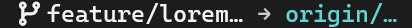
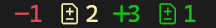

# Tmux-Git-status

Shows Git status in your [tmux](https://github.com/tmux/tmux/wiki) status bar.


**Key Features**
* Fast and lightweight
* Built with only Bash & Git - no third-party dependencies<sup>*</sup>
* Highly configurable
* [Catppuccin](https://github.com/catppuccin/tmux) integration

_( <sup>*</sup> A [Nerd Font](https://www.nerdfonts.com/)-compatible font is required to display icons correctly)_

## Installation

### Using Tmux Plugin Manager

1. Install [TPM](https://github.com/tmux-plugins/tpm)
2. Add the plugin in your `.tmux.conf`:
   ```
   set -g @plugin 'Djuuu/tmux-git-status'
   ```
3. Add the module to your status bar:
   ```
   set -ag status-left "#{git_status}"
   ```

### Manually

1. Clone the plugin
   ```
   git clone https://github.com/Djuuu/tmux-git-status.git ~/path/to/tmux-git-status
   ```
2. Run the plugin at the end of your `.tmux.conf`:
   ```
   run ~/path/to/tmux-git-status/git-status.tmux
   ```
3. Add the module to your status bar:
   ```
   set -ag status-left "#{git_status}"
   ```

### Additional Catppuccin configuration

A custom [Catppuccin](https://github.com/catppuccin/tmux) status line module is provided:

1. Define the `CATPPUCCIN_PATH` variable in your configuration
   ```
   %hidden CATPPUCCIN_PATH="/path/to/catppuccin/tmux"
   ```

1. Source the `git_status.catppuccin.conf` configuration file, after `catppuccin.tmux`
   ``` 
   # Run Catppuccin
   run "/path/to/catppuccin/tmux/catppuccin.tmux"

   # ...

   # Configure Git status catppuccin module
   source -q "/path/to/tmux-git-status/git_status.catppuccin.conf"   
   ```
1. Add the module to your status bar:
   ```
   set -ag status-left "#{@catppuccin_status_git}"
   ```

## Configuration

The Git status module content is rendered using the following template:
``` 
set -gq @git_status_format "{branch_icon}{branch}{upstream}{divergence}{action}{state}"
``` 
Available template entries:
- `{branch_icon}`: [branch icon](#branch-icon)
- `{branch}` local [branch name](#branch-name)
- `{upstream}` upstream tracking branch name
- `{divergence}` [divergence](#divergence) between local and remote branches
- `{action}` [action](#action) icon / details (if any) 
- `{state}` [state](#state) icons (if any)

Most of the icons and styles used by this module are customizable (see [configuration reference](#configuration-reference)).

### Branch icon

* Local branch  
  

* Remote tracking branch

  When your current branch has an upstream tracking branch, the branch icon reflects these remote types:

  | Remote type | Remote pattern  | Display                                                          |
  |-------------|-----------------|------------------------------------------------------------------|
  | Github      | `github.com`    |        |
  | Gitlab      | `gitlab.com`    |        |
  | Bitbucket   | `bitbucket.org` |  |
  | Forgejo     | `codeberg.org`  |      |
  | default     | `*`             |      |

* Detached state  
  
  
### Branch name

Local branch names are truncated according to the value of `@git_status_branch_max_length` (40 by default).

Upstream branch names are truncated according to the value of `@git_status_upstream_max_length` (15 by default).  
In addition, truncated upstream names will always show the whole remote name (eg: `origin/…`).

You can disable truncation by setting `*_max_length` value to 0.

* ```
  set -gq @git_status_branch_max_length 40
  set -gq @git_status_upstream_max_length 30 
  ``` 
  

* ```
  set -gq @git_status_branch_max_length 14
  set -gq @git_status_upstream_max_length 8
  ```
  

### Divergence

Divergence between your local branch and its tracking upstream can be shown in 3 modes:

* `set -gq @git_status_divergence_mode "detailed"`  
  Displays arrows with the number of commits ahead (↑) and behind (↓)  
  

* `set -gq @git_status_divergence_mode "simple"`  
  Shows only the arrows, without the counters  
  

* `set -gq @git_status_divergence_mode "single"`  
  Uses a single icon to represent the divergence state  
  

In `detailed` and `simple` modes, the order of "ahead" and "behind" indicators can be swapped with:  
```
set -gq @git_status_divergence_swap true
```


### Action

During specific Git operations, a dedicated icon is displayed (typically when an action is interrupted due to a conflict):

| Action      | Icon                                                                           |
|-------------|--------------------------------------------------------------------------------|
| cherry-pick |  <br>_(1 conflict)_  |
| merge       |  <br>_(1 conflict)_              |
| revert      |  <br>_(1 conflict)_            |
| bisect      |                                |

The _rebase_ action has a more detailed display:

  
_(rebasing `feature/ipsum-example` onto `epic/example-stuff`, stopped at commit 2 out of 4, 1 conflict)_

During rebase, the `{branch}`, `{upstream}` and `{divergence}` items are hidden to provide space for the detailed rebase information.  
You can disable this behavior with:
```
set -gq @git_status_rebase_hide_branch_info false
```

### State

Configure how the "dirty" state of your Git repository appears with these options:

* **`@git_status_state_mode`**

  - `"detailed"`  
    Shows distinct icons for each type of change:  
      
    _(1 deleted, 2 changes, 3 untracked, 1 staged)_
  
  - `"summary"`  
    Groups "changed", "deleted" and "untracked" into a single icon  
      
    _(6 "dirty" changes (deleted + changes + untracked), 1 staged)_

    Note: If only untracked files are present, a dedicated icon is used:  
      
    _(1 untracked, 1 staged)_

* **`@git_status_show_state_counters`** (`true` / `false`)
  - `true` shows the number of changes for each state
  - `false` only shows icons

  <table>
  <tr>
    <td colspan="2" rowspan="2"></td>
    <th colspan="2" align="center"> <code>@git_status_show_state_counters</code> </th>
  </tr><tr>
    <th> <code>true</code> </th>
    <th> <code>false</code> </th>
  </tr><tr>
    <th rowspan="3"> <code>@git_status_state_mode</code> </th>
    <th> <code>"detailed"</code> </th>
    <td></td>
    <td></td>
  </tr><tr>
    <th rowspan="2"> <code>"summary"</code> </th>
    <td></td>
    <td></td>
  </tr><tr>
    <td></td>
    <td></td>
  </tr>
  </table>


Additional state-related options:

* `@git_status_state_clean_icon`  
  set to empty string to display no icon when state is clean  
    

* `@git_status_state_show_stash`  
  disabled by default, set to `true` to show stash item count  
  

- `@git_status_ignore_submodules`  
  ignore submodule changes in state display (defaults to `false`)

### Catppuccin integration

The plugin integrates with the [Catppuccin](https://github.com/catppuccin/tmux) theme for tmux
(see [additional catppuccin configuration](#additional-catppuccin-configuration)).


Specific configuration variables:

* `@git_status_catppuccin_hide_outside_repository`  
  Hide whole status module when not in a repository, instead of showing empty module skeleton (defaults to `true`)

* `@git_status_catppuccin_replace_module_icon`  
  Replace Catppuccin module icon with dynamic [branch icon](#branch-icon) (defaults to `true`)

## Configuration reference

Available options (see [git-status.tmux.conf](git-status.tmux.conf)):

```
# Default base style
set -gq @git_status_default_style "#[fg=white,nobold]"

# Git status custom format. Available entries:
# - {branch_icon}   Example:  
# - {branch}        Example:  feature/example
# - {upstream}      Example:   → origin/feature/example
# - {divergence}    Example:  ↑1·↓2
# - {action}        Example:   
# - {state}         Example:  󰍴1  2 3  4
set -gq @git_status_format "{branch_icon}{branch}{upstream}{divergence}{action}{state}"

## Branch ######################################################################

set -gq @git_status_icon_style   "#[fg=white,bold]"
set -gq @git_status_branch_style "#[fg=white,bold]"

# Branch name truncation (set to 0 to disable truncation)
set -gq @git_status_branch_max_length  40

# Branch icon
set -gq @git_status_branch_icon    "" # nf-fa-code_branch
set -gq @git_status_detached_icon  " " # nf-fa-code_commit
# Branch icon for specific remote types
set -gq @git_status_github_icon         "󰊤" # nf-md-github
set -gq @git_status_gitlab_icon         "" # nf-seti-gitlab
set -gq @git_status_bitbucket_icon      "" # nf-dev-bitbucket
set -gq @git_status_forgejo_icon        "" # nf-linux-forgejo
set -gq @git_status_default_remote_icon "" # nf-fa-code_branch

## Remote ######################################################################

set -gq @git_status_upstream_prefix "#[fg=white,nobold] → "
set -gq @git_status_upstream_style  "#[fg=cyan,bold]"

# Upstream branch name truncation (set to 0 to disable truncation)
# note: when truncated, remote branch will always show the full remote name (ex: "origin/…")
set -gq @git_status_upstream_max_length 15

## Divergence ##################################################################

# Upstream divergence mode
# "detailed": display ahead & behind arrow icons, with commit count
# "simple": display ahead & behind arrow icons, without commit count
# "single": display single icon (ahead/behind/diverged)
set -gq @git_status_divergence_mode "detailed" # "detailed" | "simple" | "single"

# "detailed" / "simple" divergence display icons
set -gq @git_status_ahead_icon           "#[fg=green,bold]↑"
set -gq @git_status_behind_icon          "#[fg=red,bold]↓"
set -gq @git_status_divergence_separator "#[fg=#666666]·"

# Swap "ahead" and "behind" indicators position
set -gq @git_status_divergence_swap false

# "single" divergence mode icons
set -gq @git_status_divergence_single_ahead_icon    "#[fg=green,bold]" # nf-fa-arrow_up
set -gq @git_status_divergence_single_behind_icon   "#[fg=red,bold]"   # nf-fa-arrow_down
set -gq @git_status_divergence_single_diverged_icon "#[fg=yellow,bold]" # nf-fa-arrows_up_down

## Action ######################################################################

# Action display prefix & suffix
set -gq @git_status_action_prefix  " #[fg=yellow,bold]"
set -gq @git_status_action_suffix  "#[fg=yellow,bold]"

# Action icons (shown during specific actions, usually on conflict)
set -gq @git_status_action_rebase_icon  " ☈ "  # nf-oct-git_merge
set -gq @git_status_action_merge_icon   ""   # nf-oct-git_merge
set -gq @git_status_action_cherry_icon  " " # nf-fae-cherry
set -gq @git_status_action_revert_icon  " "  # nf-fa-rotate_left
set -gq @git_status_action_bisect_icon  "?"  # nf-fa-arrows_up_down

# Rebase action specific display
set -gq @git_status_rebase_head_style   "#[fg=yellow,bold]"
set -gq @git_status_rebase_target_style "#[fg=cyan,bold]"
set -gq @git_status_rebase_head_target_separator " ↷ "
set -gq @git_status_rebase_interactive_edit_icon "#[fg=yellow] " # nf-fa-edit

# Progress counter style
set -gq @git_status_rebase_progress_style "#[fg=yellow,bold]"
# Progress counter style when stopped because of conflict
set -gq @git_status_rebase_conflict_style "#[fg=red,bold]"

# Hide branch info (branch, remote, divergence) during rebase, to leave room for detailed rebase info
set -gq @git_status_rebase_hide_branch_info true

## State #######################################################################

# Status icon mode
# - "detailed" : show individual icons for "changed", "deleted", "untracked", etc.
# - "summary" : group "changed", "deleted" and "untracked" in a single icon
set -gq @git_status_state_mode "detailed"

# Ignore submodules in got state
set -gq @git_status_ignore_submodules false

# Show counters for each state (when false, only icons will be shown)
set -gq @git_status_show_state_counters true

set -gq @git_status_state_prefix         " "
set -gq @git_status_state_clean_icon     "#[fg=green,bold] "  # nf-cod-sparkle
set -gq @git_status_state_deleted_icon   "#[fg=red,bold]󰍴"     # nf-md-minus
set -gq @git_status_state_changed_icon   "#[fg=yellow,bold] " # nf-cod-request_changes
set -gq @git_status_state_untracked_icon "#[fg=green,bold]"   # nf-oct-plus
set -gq @git_status_state_staged_icon    "#[fg=green,bold] "  # nf-cod-request_changes
set -gq @git_status_state_conflict_icon  "#[fg=red,bold] "    # nf-fa-arrows_left_right

set -gq @git_status_state_show_stash   false
set -gq @git_status_state_stashes_icon "#[fg=cyan,nobold] " # nf-fa-buffer

## Catppuccin integration ######################################################

# Hide whole status module when not in a repository, instead of showing empty module skeleton
set -gq @git_status_catppuccin_hide_outside_repository true

# Replace Catppuccin module icon with dynamic branch icon
set -gq @git_status_catppuccin_replace_module_icon true
```

## Inspiration & alternatives

- https://github.com/arl/gitmux
- https://github.com/arl/tmux-gitbar
- https://github.com/romkatv/gitstatus
